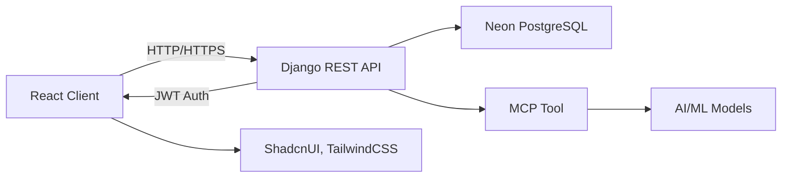

# AI Learning Platform

Welcome to the **AI Learning Platform**, a comprehensive, full-stack digital ecosystem engineered to support and optimize student learning through structured resource organization, intelligent recommendations, and interactive progress monitoring.

> Empowering learners to realize their academic aspirations through intelligent, data-driven pathways.

---

## Table of Contents

1. [Project Overview](#project-overview)
2. [Core Features](#core-features)
3. [Technology Stack](#technology-stack)
4. [System Architecture](#system-architecture)
5. [Initial Setup](#initial-setup)

   * [Prerequisites](#prerequisites)
   * [Installation Guide](#installation-guide)
   * [Development Server](#development-server)
6. [Configuration Parameters](#configuration-parameters)
7. [Database Infrastructure](#database-infrastructure)
8. [Security and Authentication](#security-and-authentication)
9. [User Interface Modules](#user-interface-modules)
10. [API Endpoint Reference](#api-endpoint-reference)
11. [Machine Learning Integration (MCP Tool)](#machine-learning-integration-mcp-tool)
12. [Development Roadmap](#development-roadmap)
13. [Contribution Guidelines](#contribution-guidelines)
14. [Licensing Information](#licensing-information)

---

## Project Overview

The AI Learning Platform is an advanced educational technology framework designed to enhance the academic experience by facilitating the personalized organization of learning content. By leveraging artificial intelligence, modular frontend design, and secure backend services, the platform provides a multidimensional interface for content curation, adaptive study planning, collaboration, and real-time analytics.

Key objectives include:

* Centralizing diverse learning materials (e.g., lecture notes, videos, readings)
* Generating intelligent study pathways tailored to user behavior
* Supporting peer-to-peer content exchange and review
* Enabling comprehensive performance tracking through data visualization
* Maintaining robust account security and role-based access

## Core Features

* **Content Curation**: Users can upload, classify, and search for educational materials within an intuitive interface.
* **Adaptive Recommendations**: AI algorithms propose contextually relevant resources and study tasks.
* **Dynamic Study Planner**: A flexible scheduler enabling goal-driven academic planning.
* **Progress Analytics**: Insightful metrics on learning efficiency, engagement time, and task completion.
* **Social Learning Tools**: Peer sharing, commentary, and collaborative annotations.
* **User Notifications**: Time-sensitive reminders and system alerts.
* **Access Control**: Role-dependent permissions for Students, Instructors, and Administrators.

## Technology Stack

### Front-end

* **ReactJS** – Component-based UI architecture
* **Vercel** – Serverless deployment and hosting
* **Tailwind CSS** – Utility-first design system
* **Shadcn/UI** – Predefined accessible component suite
* **Accentinity UI** – Advanced theme and color token management
* **JWT** – Session management via secure JSON Web Tokens

### Back-end

* **Django** – High-level Python web framework
* **Django REST Framework** – RESTful API generation
* **djangorestframework-simplejwt** – JWT-based authentication handler
* **Neon DB** – Cloud-native PostgreSQL database service
* **MCP Tool** – Modular pipeline controller for ML model integration

## System Architecture



### Architectural Highlights:

* **Front-end**: Deployed via Vercel, styled with Tailwind and Shadcn components
* **Back-end**: API layer protected by token-based authentication
* **Persistence Layer**: PostgreSQL database hosted on Neon for scalability
* **AI Pipeline**: AI operations orchestrated through a dedicated MCP service

## Initial Setup

### Prerequisites

* Node.js (v16 or later)
* npm or yarn
* Python 3.9+
* pip or Poetry (dependency managers)
* PostgreSQL (Neon DB credentials)

### Installation Guide

1. **Repository Setup**

```bash
git clone https://github.com/unmatched/note-learn.git
cd note-learn
```

2. **Back-end Configuration**

```bash
cd backend
python -m venv venv
source venv/bin/activate
pip install -r requirements.txt
```

3. **Front-end Configuration**

```bash
cd ../frontend
npm install  # or yarn
```

### Development Server

* Launch Django Server:

```bash
cd backend
source venv/bin/activate
python manage.py migrate
python manage.py runserver
```

* Launch React Client:

```bash
cd frontend
npm run dev
```

Access the UI at `http://localhost:3000` and the API at `http://localhost:8000/api`

## Configuration Parameters

Create a `.env` file in each project root (`/backend` and `/frontend`):

### Backend (`/backend/.env`)

```
DEBUG=True
SECRET_KEY=your_django_secret_key
DATABASE_URL=postgres://<user>:<pass>@<host>:<port>/<db_name>
SIMPLE_JWT_SECRET_KEY=your_jwt_secret_key
```

### Frontend (`/frontend/.env`)

```
NEXT_PUBLIC_API_URL=http://localhost:8000/api
JWT_STORAGE_KEY=authToken
```

## Database Infrastructure

* Managed through Django ORM
* Deployed via Neon DB for automated scaling and connection pooling
* Migration commands:

```bash
python manage.py makemigrations
python manage.py migrate
```

## Security and Authentication

* **JWT Implementation** via `djangorestframework-simplejwt`:

  * Dual-token structure (access/refresh)
  * Supports token rotation and blacklist
* **CORS** policies tailored to frontend domain
* **HTTPS** enforced in production

## User Interface Modules

* **Dashboard**: High-level summaries including visual analytics
* **Resource Library**: Filterable content explorer
* **Study Planner**: Interactive drag-and-drop task manager
* **Collaboration**: Real-time messaging and peer feedback (WebSockets)

## API Endpoint Reference

| Endpoint         | Method   | Purpose                                     |
| ---------------- | -------- | ------------------------------------------- |
| `/auth/login/`   | POST     | Obtain access and refresh tokens            |
| `/auth/refresh/` | POST     | Generate a new access token                 |
| `/users/`        | GET/POST | List or create new user profiles            |
| `/materials/`    | GET/POST | Upload or retrieve learning resources       |
| `/plans/`        | GET/POST | Manage user-specific study schedules        |
| `/analytics/`    | GET      | Query learning metrics and performance data |

## Machine Learning Integration (MCP Tool)

* **Function**: Serve as an intermediary layer between resource ingestion and ML pipeline execution.
* **Operational Flow**:

  1. User uploads educational content.
  2. Django backend triggers a registered MCP job.
  3. The MCP service tokenizes, classifies, and stores metadata.
  4. Downstream services consume metadata for recommendation or insights.

## Development Roadmap

* [ ] GitHub Actions CI/CD pipeline
* [ ] Backend deployment to managed environment (e.g., AWS ECS, Vercel Functions)
* [ ] User avatar and bio customization
* [ ] Notification infrastructure (email + in-app toasts)
* [ ] Advanced collaborative filtering models
* [ ] Internationalization (i18n) support
* [ ] Comprehensive testing and coverage reports
* [ ] Progressive Web App (PWA) conversion

## Contribution Guidelines

We welcome scholarly contributions. To contribute:

1. Fork this repository.
2. Create a topic-specific branch:

```bash
git checkout -b feature/your-feature-name
```

3. Commit changes and write descriptive messages:

```bash
git commit -m "feat: implemented [your feature]"
```

4. Push the branch:

```bash
git push origin feature/your-feature-name
```

5. Open a Pull Request and link to relevant issues.

## Licensing Information

This project is made available under the terms of the [GNU General Public License v3.0](LICENSE).
